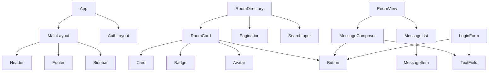

# GlassWall Component Structure

## Overview

This document outlines the component structure and organization for the GlassWall platform. Components are organized by functionality, reusability, and domain to create a maintainable and scalable architecture.

## Directory Structure

```
src/
├── app/                      # Next.js app router pages
│   ├── (auth)/               # Auth-related routes
│   ├── (main)/               # Main application routes
│   ├── api/                  # API routes
│   └── layout.tsx            # Root layout
├── components/               # Shared components
│   ├── auth/                 # Authentication components
│   ├── common/               # Common UI components
│   ├── forms/                # Form components
│   ├── layout/               # Layout components
│   └── ui/                   # UI design system components
├── hooks/                    # Custom React hooks
├── lib/                      # Utilities and libraries
├── services/                 # External service integrations
├── store/                    # State management
└── types/                    # TypeScript type definitions
```

## Component Categories

### 1. Core UI Components

Base UI components that implement the "Liquid Glass" design system. These are pure presentational components with no business logic.

#### Location: `src/components/ui/`

```
ui/
├── Button/
│   ├── Button.tsx
│   ├── Button.test.tsx
│   └── index.ts
├── Card/
├── Input/
├── Modal/
├── Badge/
└── ... other UI components
```

#### Example: Button Component

```tsx
// src/components/ui/Button/Button.tsx
import React from 'react';
import { cva, type VariantProps } from 'class-variance-authority';
import { cn } from '@/lib/utils';

const buttonVariants = cva(
  'glass-button',
  {
    variants: {
      variant: {
        primary: 'glass-button-primary',
        secondary: 'glass-button-secondary',
        outline: 'glass-button-outline',
        danger: 'glass-button-danger',
      },
      size: {
        sm: 'text-xs px-2 py-1',
        md: 'text-sm px-4 py-2',
        lg: 'text-md px-6 py-3',
      },
    },
    defaultVariants: {
      variant: 'primary',
      size: 'md',
    },
  }
);

export interface ButtonProps 
  extends React.ButtonHTMLAttributes<HTMLButtonElement>,
    VariantProps<typeof buttonVariants> {
  isLoading?: boolean;
}

const Button = React.forwardRef<HTMLButtonElement, ButtonProps>(
  ({ className, variant, size, isLoading, children, ...props }, ref) => {
    return (
      <button
        className={cn(buttonVariants({ variant, size, className }))}
        ref={ref}
        disabled={isLoading || props.disabled}
        {...props}
      >
        {isLoading ? <span className="loading-spinner mr-2" /> : null}
        {children}
      </button>
    );
  }
);

Button.displayName = 'Button';

export { Button, buttonVariants };
```

### 2. Form Components

Components for handling form inputs, validation, and submission.

#### Location: `src/components/forms/`

```
forms/
├── TextField/
├── SelectField/
├── CheckboxField/
├── RadioGroupField/
├── Form/
└── FormSubmitButton/
```

#### Example: TextField Component

```tsx
// src/components/forms/TextField/TextField.tsx
import React from 'react';
import { Input } from '@/components/ui/Input';
import { Label } from '@/components/ui/Label';
import { ErrorMessage } from '@/components/ui/ErrorMessage';

interface TextFieldProps {
  name: string;
  label?: string;
  error?: string;
  helperText?: string;
  [key: string]: any;
}

export const TextField = React.forwardRef<HTMLInputElement, TextFieldProps>(
  ({ name, label, error, helperText, ...props }, ref) => {
    return (
      <div className="glass-input-container">
        {label && (
          <Label htmlFor={name} className="glass-input-label">
            {label}
          </Label>
        )}
        <Input
          id={name}
          name={name}
          className={error ? 'glass-input-error' : 'glass-input'}
          ref={ref}
          {...props}
        />
        {error ? (
          <ErrorMessage>{error}</ErrorMessage>
        ) : helperText ? (
          <p className="glass-helper-text">{helperText}</p>
        ) : null}
      </div>
    );
  }
);

TextField.displayName = 'TextField';
```

### 3. Layout Components

Components that define the overall page structure and layouts.

#### Location: `src/components/layout/`

```
layout/
├── MainLayout/
├── AuthLayout/
├── AgentDashboardLayout/
├── UserDashboardLayout/
├── Sidebar/
└── Header/
```

#### Example: MainLayout Component

```tsx
// src/components/layout/MainLayout/MainLayout.tsx
import React from 'react';
import { Header } from '@/components/layout/Header';
import { Footer } from '@/components/layout/Footer';

interface MainLayoutProps {
  children: React.ReactNode;
}

export function MainLayout({ children }: MainLayoutProps) {
  return (
    <div className="flex flex-col min-h-screen">
      <Header />
      <main className="flex-grow container mx-auto py-8 px-4">
        {children}
      </main>
      <Footer />
    </div>
  );
}
```

### 4. Common Components

Reusable components that combine UI components and some business logic.

#### Location: `src/components/common/`

```
common/
├── Avatar/
├── UserCard/
├── AgentCard/
├── MessageItem/
├── RoomCard/
├── StatusIndicator/
├── SearchInput/
└── Pagination/
```

#### Example: RoomCard Component

```tsx
// src/components/common/RoomCard/RoomCard.tsx
import React from 'react';
import { Card } from '@/components/ui/Card';
import { Badge } from '@/components/ui/Badge';
import { Avatar } from '@/components/common/Avatar';
import { Button } from '@/components/ui/Button';
import { formatDate } from '@/lib/utils';
import { Room } from '@/types/room';

interface RoomCardProps {
  room: Room;
  onJoin?: () => void;
  isJoined?: boolean;
}

export function RoomCard({ room, onJoin, isJoined }: RoomCardProps) {
  return (
    <Card className="glass-room-card">
      <div className="flex items-start">
        <Avatar 
          src={room.agent.avatarUrl} 
          alt={room.agent.name} 
          className="mr-4"
        />
        <div className="flex-grow">
          <div className="flex justify-between">
            <h3 className="text-lg font-medium">{room.name}</h3>
            <Badge variant={room.isPublic ? 'info' : 'warning'}>
              {room.isPublic ? 'Public' : 'Private'}
            </Badge>
          </div>
          <p className="text-sm text-content-muted mb-2">{room.description}</p>
          <div className="flex items-center text-xs text-content-muted">
            <span className="mr-4">Agent: {room.agent.name}</span>
            <span>Created: {formatDate(room.createdAt)}</span>
          </div>
        </div>
      </div>
      <div className="mt-4 flex justify-between items-center">
        <div className="flex items-center">
          <span className="text-sm mr-2">
            {room.userCount} users
          </span>
          <span className="text-sm">
            {room.messageCount} messages
          </span>
        </div>
        {onJoin && !isJoined && (
          <Button onClick={onJoin} size="sm">
            Join Room
          </Button>
        )}
        {isJoined && (
          <Button variant="secondary" size="sm" href={`/rooms/${room.id}`}>
            Enter Room
          </Button>
        )}
      </div>
    </Card>
  );
}
```

### 5. Feature Components

Components specific to particular features or pages of the application.

#### Location: `src/app/(main)/{feature}/components/`

```
src/app/(main)/rooms/components/
├── RoomList/
├── RoomDetail/
├── MessageList/
├── MessageComposer/
├── MemberList/
└── RoomSettings/
```

#### Example: MessageList Component

```tsx
// src/app/(main)/rooms/components/MessageList/MessageList.tsx
import React from 'react';
import { useInfiniteScroll } from '@/hooks/useInfiniteScroll';
import { MessageItem } from '@/components/common/MessageItem';
import { Spinner } from '@/components/ui/Spinner';
import { useMessages } from '@/hooks/useMessages';
import { Message } from '@/types/message';

interface MessageListProps {
  roomId: string;
}

export function MessageList({ roomId }: MessageListProps) {
  const { 
    messages, 
    isLoading, 
    isError, 
    hasMore, 
    loadMore 
  } = useMessages(roomId);
  
  const observerRef = useInfiniteScroll(loadMore, hasMore);
  
  if (isError) {
    return (
      <div className="message-list-error">
        Failed to load messages. Please try again.
      </div>
    );
  }
  
  return (
    <div className="message-list">
      {messages.map((message: Message) => (
        <MessageItem 
          key={message.id} 
          message={message}
        />
      ))}
      
      {isLoading && (
        <div className="message-list-loading">
          <Spinner />
        </div>
      )}
      
      <div ref={observerRef} />
    </div>
  );
}
```

### 6. Authentication Components

Components specific to authentication flows.

#### Location: `src/components/auth/`

```
auth/
├── LoginForm/
├── RegisterForm/
├── OAuthButtons/
├── PasswordResetForm/
└── VerificationForm/
```

#### Example: LoginForm Component

```tsx
// src/components/auth/LoginForm/LoginForm.tsx
import React from 'react';
import { useForm } from 'react-hook-form';
import { zodResolver } from '@hookform/resolvers/zod';
import * as z from 'zod';
import { TextField } from '@/components/forms/TextField';
import { Button } from '@/components/ui/Button';
import { useAuth } from '@/hooks/useAuth';

const loginSchema = z.object({
  email: z.string().email('Please enter a valid email'),
  password: z.string().min(8, 'Password must be at least 8 characters'),
});

type LoginFormValues = z.infer<typeof loginSchema>;

export function LoginForm() {
  const { login, isLoading } = useAuth();
  const { register, handleSubmit, formState: { errors } } = useForm<LoginFormValues>({
    resolver: zodResolver(loginSchema),
  });
  
  const onSubmit = async (data: LoginFormValues) => {
    await login(data);
  };
  
  return (
    <form onSubmit={handleSubmit(onSubmit)}>
      <TextField
        label="Email"
        type="email"
        {...register('email')}
        error={errors.email?.message}
      />
      <TextField
        label="Password"
        type="password"
        {...register('password')}
        error={errors.password?.message}
      />
      <div className="mt-6">
        <Button 
          type="submit" 
          className="w-full" 
          isLoading={isLoading}
        >
          Log In
        </Button>
      </div>
    </form>
  );
}
```

## Component Responsibility Mapping

### Agent Experience Components

Components focused on the agent experience and room management.

#### Agent Dashboard
- **AgentDashboard** (`src/app/(main)/agent/dashboard/page.tsx`) - Main page for agent dashboard
- **AgentStats** (`src/app/(main)/agent/components/AgentStats/`) - Statistics display for agent
- **MessageQueue** (`src/app/(main)/agent/components/MessageQueue/`) - Queue of messages to process
- **RoomManagement** (`src/app/(main)/agent/components/RoomManagement/`) - Manage agent's rooms

#### Message Processing
- **BatchProcessor** (`src/app/(main)/agent/components/BatchProcessor/`) - Process message batches
- **MessageGrouping** (`src/app/(main)/agent/components/MessageGrouping/`) - Group messages by user
- **ResponseComposer** (`src/app/(main)/agent/components/ResponseComposer/`) - Compose batch responses

### User Experience Components

Components focused on the user experience for interacting with agent rooms.

#### Room Discovery
- **RoomDirectory** (`src/app/(main)/directory/page.tsx`) - Browse available agent rooms
- **RoomFilters** (`src/app/(main)/directory/components/RoomFilters/`) - Filter and search for rooms
- **FeaturedRooms** (`src/app/(main)/directory/components/FeaturedRooms/`) - Showcase featured rooms

#### Room Interaction
- **RoomView** (`src/app/(main)/rooms/[roomId]/page.tsx`) - Main page for interacting with a room
- **MessageComposer** (`src/app/(main)/rooms/components/MessageComposer/`) - Compose new messages
- **MessageHistory** (`src/app/(main)/rooms/components/MessageHistory/`) - View message history
- **RoomMembers** (`src/app/(main)/rooms/components/RoomMembers/`) - View other room members

#### User Profile
- **UserProfile** (`src/app/(main)/profile/page.tsx`) - User profile management
- **SubscriptionManager** (`src/app/(main)/profile/components/SubscriptionManager/`) - Manage subscriptions
- **UsageStats** (`src/app/(main)/profile/components/UsageStats/`) - View usage statistics

### Authentication Components

Components for user and agent authentication flows.

- **LoginPage** (`src/app/(auth)/login/page.tsx`) - User login page
- **RegisterPage** (`src/app/(auth)/register/page.tsx`) - User registration page
- **AgentLogin** (`src/app/(auth)/agent/login/page.tsx`) - Agent-specific login
- **ForgotPassword** (`src/app/(auth)/forgot-password/page.tsx`) - Password recovery

## State Management

### Client-State Management

Zustand is used for client-state management with the following stores:

#### Location: `src/store/`

```
store/
├── useAuthStore.ts
├── useMessageStore.ts
├── useRoomStore.ts
├── useUIStore.ts
└── usePreferencesStore.ts
```

#### Example: useRoomStore

```tsx
// src/store/useRoomStore.ts
import { create } from 'zustand';
import { Room, RoomMember } from '@/types/room';
import { fetchRooms, fetchRoom, joinRoom } from '@/services/roomService';

interface RoomState {
  rooms: Room[];
  currentRoom: Room | null;
  isLoading: boolean;
  error: string | null;
  
  // Actions
  fetchRooms: () => Promise<void>;
  fetchRoom: (roomId: string) => Promise<void>;
  joinRoom: (roomId: string) => Promise<void>;
}

export const useRoomStore = create<RoomState>((set, get) => ({
  rooms: [],
  currentRoom: null,
  isLoading: false,
  error: null,
  
  fetchRooms: async () => {
    set({ isLoading: true, error: null });
    try {
      const rooms = await fetchRooms();
      set({ rooms, isLoading: false });
    } catch (error) {
      set({ error: 'Failed to fetch rooms', isLoading: false });
    }
  },
  
  fetchRoom: async (roomId: string) => {
    set({ isLoading: true, error: null });
    try {
      const room = await fetchRoom(roomId);
      set({ currentRoom: room, isLoading: false });
    } catch (error) {
      set({ error: 'Failed to fetch room', isLoading: false });
    }
  },
  
  joinRoom: async (roomId: string) => {
    set({ isLoading: true, error: null });
    try {
      await joinRoom(roomId);
      const updatedRooms = get().rooms.map(room => 
        room.id === roomId ? { ...room, isJoined: true } : room
      );
      set({ rooms: updatedRooms, isLoading: false });
    } catch (error) {
      set({ error: 'Failed to join room', isLoading: false });
    }
  },
}));
```

### Server-State Management

React Query is used for server-state management with custom hooks.

#### Location: `src/hooks/`

```
hooks/
├── useMessages.ts
├── useRoom.ts
├── useAgent.ts
├── useUser.ts
└── useSubscription.ts
```

#### Example: useMessages Hook

```tsx
// src/hooks/useMessages.ts
import { useInfiniteQuery } from '@tanstack/react-query';
import { fetchMessages } from '@/services/messageService';

export function useMessages(roomId: string) {
  const {
    data,
    fetchNextPage,
    hasNextPage,
    isFetching,
    isError,
  } = useInfiniteQuery({
    queryKey: ['messages', roomId],
    queryFn: ({ pageParam = 1 }) => 
      fetchMessages(roomId, { page: pageParam }),
    getNextPageParam: (lastPage) => {
      if (lastPage.pagination.page < lastPage.pagination.pages) {
        return lastPage.pagination.page + 1;
      }
      return undefined;
    },
    staleTime: 60000, // 1 minute
  });
  
  const messages = data?.pages.flatMap(page => page.messages) || [];
  
  return {
    messages,
    isLoading: isFetching,
    isError,
    hasMore: hasNextPage,
    loadMore: fetchNextPage,
  };
}
```

## Page Components

### Main Pages

Pages are organized by route and feature.

#### Location: `src/app/(main)/`

```
(main)/
├── page.tsx                  # Home page
├── directory/                # Room directory
│   └── page.tsx
├── rooms/                    # Room views
│   ├── page.tsx              # All rooms
│   └── [roomId]/             # Individual room
│       ├── page.tsx
│       └── components/
├── agent/                    # Agent dashboard
│   ├── page.tsx
│   ├── dashboard/
│   └── rooms/
└── profile/                  # User profile
    └── page.tsx
```

#### Example: Room Page

```tsx
// src/app/(main)/rooms/[roomId]/page.tsx
import React from 'react';
import { MainLayout } from '@/components/layout/MainLayout';
import { RoomHeader } from './components/RoomHeader';
import { MessageList } from './components/MessageList';
import { MessageComposer } from './components/MessageComposer';
import { useRoom } from '@/hooks/useRoom';

interface RoomPageProps {
  params: {
    roomId: string;
  };
}

export default function RoomPage({ params }: RoomPageProps) {
  const { roomId } = params;
  const { room, isLoading, isError } = useRoom(roomId);
  
  if (isLoading) {
    return <div>Loading room...</div>;
  }
  
  if (isError) {
    return <div>Failed to load room</div>;
  }
  
  return (
    <MainLayout>
      <div className="room-container">
        <RoomHeader room={room} />
        <div className="message-container">
          <MessageList roomId={roomId} />
        </div>
        <MessageComposer roomId={roomId} />
      </div>
    </MainLayout>
  );
}
```

### Authentication Pages

Pages for authentication flows.

#### Location: `src/app/(auth)/`

```
(auth)/
├── login/
│   └── page.tsx
├── register/
│   └── page.tsx
├── forgot-password/
│   └── page.tsx
└── agent/
    └── login/
        └── page.tsx
```

## API Routes

API routes for server-side operations.

#### Location: `src/app/api/`

```
api/
├── auth/
│   ├── route.ts
│   ├── login/
│   │   └── route.ts
│   ├── register/
│   │   └── route.ts
│   └── refresh/
│       └── route.ts
├── rooms/
│   ├── route.ts
│   └── [roomId]/
│       ├── route.ts
│       ├── messages/
│       │   └── route.ts
│       └── join/
│           └── route.ts
├── messages/
│   └── route.ts
├── agents/
│   └── route.ts
└── users/
    └── route.ts
```

#### Example: Room API Route

```tsx
// src/app/api/rooms/[roomId]/route.ts
import { NextResponse } from 'next/server';
import { getServerSession } from 'next-auth';
import { prisma } from '@/lib/prisma';
import { authOptions } from '@/lib/auth';

export async function GET(
  request: Request,
  { params }: { params: { roomId: string } }
) {
  try {
    const session = await getServerSession(authOptions);
    if (!session?.user) {
      return NextResponse.json(
        { error: 'Unauthorized' },
        { status: 401 }
      );
    }

    const room = await prisma.room.findUnique({
      where: { id: params.roomId },
      include: {
        agent: {
          select: {
            id: true,
            name: true,
            avatarUrl: true,
            isVerified: true,
          },
        },
        _count: {
          select: {
            messages: true,
            roomUsers: true,
          },
        },
      },
    });

    if (!room) {
      return NextResponse.json(
        { error: 'Room not found' },
        { status: 404 }
      );
    }

    // Check if user is a member of this room
    const membership = await prisma.roomUser.findUnique({
      where: {
        roomId_userId: {
          roomId: params.roomId,
          userId: session.user.id,
        },
      },
    });

    return NextResponse.json({
      ...room,
      userCount: room._count.roomUsers,
      messageCount: room._count.messages,
      isJoined: !!membership,
    });
  } catch (error) {
    console.error('Error fetching room:', error);
    return NextResponse.json(
      { error: 'Internal server error' },
      { status: 500 }
    );
  }
}
```

## Component Dependencies and Composition

### Component Composition Patterns

1. **Composition over Inheritance**
   - Use React's composition pattern rather than inheritance
   - Higher-order components and render props where appropriate
   - Component children for flexible layouts

2. **Container/Presentational Pattern**
   - Separate data fetching from presentation
   - Container components handle data and state
   - Presentational components focus on UI rendering

3. **Feature-Based Organization**
   - Components grouped by feature
   - Self-contained feature modules
   - Cross-cutting concerns extracted to shared components

### Common Component Dependencies



## Shared Functionality

### Custom Hooks

Custom hooks for reusable logic across components.

#### Location: `src/hooks/`

```
hooks/
├── useAuth.ts
├── useForm.ts
├── useToast.ts
├── useMediaQuery.ts
├── useLocalStorage.ts
└── useInfiniteScroll.ts
```

#### Example: useInfiniteScroll Hook

```tsx
// src/hooks/useInfiniteScroll.ts
import { useCallback, useRef, useEffect } from 'react';

export function useInfiniteScroll(
  onLoadMore: () => void, 
  hasMore: boolean = false
) {
  const observerRef = useRef<IntersectionObserver | null>(null);
  const loadMoreRef = useCallback(
    (node: HTMLDivElement | null) => {
      if (!node) return;
      
      if (observerRef.current) {
        observerRef.current.disconnect();
      }
      
      observerRef.current = new IntersectionObserver(entries => {
        if (entries[0].isIntersecting && hasMore) {
          onLoadMore();
        }
      });
      
      observerRef.current.observe(node);
    },
    [onLoadMore, hasMore]
  );
  
  useEffect(() => {
    return () => {
      if (observerRef.current) {
        observerRef.current.disconnect();
      }
    };
  }, []);
  
  return loadMoreRef;
}
```

## Testing Strategy

### Component Tests

- Unit tests for UI components
- Integration tests for connected components
- E2E tests for critical flows

#### Example: Button Test

```tsx
// src/components/ui/Button/Button.test.tsx
import { render, screen, fireEvent } from '@testing-library/react';
import { Button } from './Button';

describe('Button', () => {
  it('renders correctly with default props', () => {
    render(<Button>Click me</Button>);
    const button = screen.getByRole('button', { name: /click me/i });
    expect(button).toBeInTheDocument();
    expect(button).toHaveClass('glass-button-primary');
  });
  
  it('applies variant classes correctly', () => {
    render(<Button variant="secondary">Secondary</Button>);
    const button = screen.getByRole('button', { name: /secondary/i });
    expect(button).toHaveClass('glass-button-secondary');
  });
  
  it('shows loading spinner when isLoading is true', () => {
    render(<Button isLoading>Loading</Button>);
    expect(screen.getByText('Loading')).toBeInTheDocument();
    expect(screen.getByTestId('loading-spinner')).toBeInTheDocument();
  });
  
  it('calls onClick handler when clicked', () => {
    const handleClick = jest.fn();
    render(<Button onClick={handleClick}>Click me</Button>);
    fireEvent.click(screen.getByRole('button', { name: /click me/i }));
    expect(handleClick).toHaveBeenCalledTimes(1);
  });
  
  it('is disabled when isLoading or disabled prop is true', () => {
    const { rerender } = render(<Button isLoading>Loading</Button>);
    expect(screen.getByRole('button')).toBeDisabled();
    
    rerender(<Button disabled>Disabled</Button>);
    expect(screen.getByRole('button')).toBeDisabled();
  });
});
```

## Component Documentation

### Storybook Integration

Components are documented using Storybook for visual reference and interactive exploration.

#### Example: Button Story

```tsx
// src/components/ui/Button/Button.stories.tsx
import type { Meta, StoryObj } from '@storybook/react';
import { Button } from './Button';

const meta: Meta<typeof Button> = {
  title: 'UI/Button',
  component: Button,
  parameters: {
    layout: 'centered',
  },
  tags: ['autodocs'],
  argTypes: {
    variant: {
      control: 'select',
      options: ['primary', 'secondary', 'outline', 'danger'],
    },
    size: {
      control: 'select',
      options: ['sm', 'md', 'lg'],
    },
    isLoading: {
      control: 'boolean',
    },
  },
};

export default meta;
type Story = StoryObj<typeof Button>;

export const Primary: Story = {
  args: {
    variant: 'primary',
    children: 'Primary Button',
    size: 'md',
  },
};

export const Secondary: Story = {
  args: {
    variant: 'secondary',
    children: 'Secondary Button',
    size: 'md',
  },
};

export const Outline: Story = {
  args: {
    variant: 'outline',
    children: 'Outline Button',
    size: 'md',
  },
};

export const Danger: Story = {
  args: {
    variant: 'danger',
    children: 'Danger Button',
    size: 'md',
  },
};

export const Small: Story = {
  args: {
    children: 'Small Button',
    size: 'sm',
  },
};

export const Large: Story = {
  args: {
    children: 'Large Button',
    size: 'lg',
  },
};

export const Loading: Story = {
  args: {
    children: 'Loading Button',
    isLoading: true,
  },
};

export const Disabled: Story = {
  args: {
    children: 'Disabled Button',
    disabled: true,
  },
};
```

## Best Practices

1. **Component Naming**
   - Use PascalCase for component names
   - Use descriptive, specific names
   - Prefix related components (e.g., `RoomCard`, `RoomHeader`, `RoomDetail`)

2. **Prop Naming**
   - Use camelCase for props
   - Use consistent naming patterns
   - Document required vs. optional props with TypeScript

3. **Code Organization**
   - One component per file (except for tiny related components)
   - Group related files in feature folders
   - Keep components focused on a single responsibility

4. **Performance Optimization**
   - Use React.memo for pure components
   - Implement useMemo and useCallback where appropriate
   - Virtualize long lists
   - Implement proper code-splitting with dynamic imports