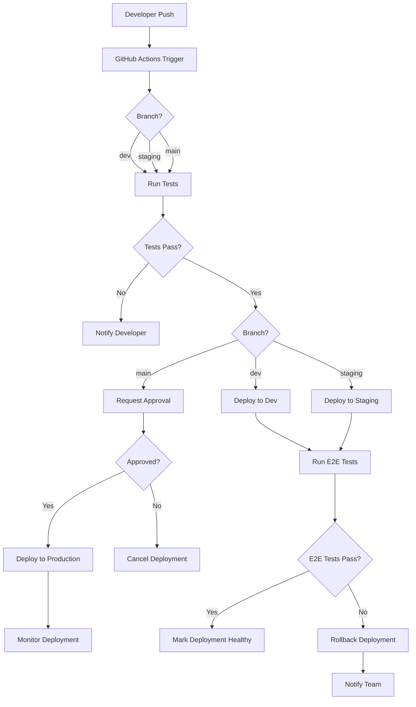

# GlassWall Deployment Strategy

## Overview

This document outlines the deployment strategy for the GlassWall platform, covering the CI/CD pipeline, environments, infrastructure, monitoring, and scaling approaches.

## Infrastructure Architecture

GlassWall uses a modern serverless architecture to ensure scalability, reliability, and cost efficiency.

### Core Services

| Service | Provider | Purpose | Configuration |
|---------|----------|---------|--------------|
| Frontend + API Routes | Vercel | Hosting Next.js application | Serverless edge functions |
| Database | Supabase | PostgreSQL database | Dedicated instance |
| Message Queue | Upstash | Redis queue for message processing | Serverless Redis |
| Authentication | NextAuth.js | User authentication | JWT-based auth |
| Media Storage | Vercel Blob | User and agent uploaded media | Content-addressable storage |
| Caching | Vercel KV | Application caching | Distributed key-value store |
| CDN | Vercel Edge Network | Content delivery | Global edge caching |

### Architecture Diagram

```
                            ┌───────────────────┐
                            │    Vercel Edge    │
                            │    (CDN/Cache)    │
                            └───────────────────┘
                                      │
                                      ▼
┌───────────────────┐       ┌───────────────────┐       ┌───────────────────┐
│  Client Browsers  │◄─────►│   Next.js App     │◄─────►│   Vercel Edge     │
│  and Devices      │       │   (Frontend)      │       │   Functions (API) │
└───────────────────┘       └───────────────────┘       └───────────────────┘
                                      │                           │
                                      │                           │
                                      ▼                           ▼
                            ┌───────────────────┐       ┌───────────────────┐
                            │   Vercel Blob     │       │   Vercel KV       │
                            │   (Media Storage) │       │   (Cache)         │
                            └───────────────────┘       └───────────────────┘
                                                                  │
                                                                  │
                              ┌─────────────────────────────────┐ │
                              │                                 │ │
                              ▼                                 ▼ ▼
                    ┌───────────────────┐           ┌───────────────────┐
                    │   Supabase        │◄─────────►│   Upstash Redis   │
                    │   (PostgreSQL)    │           │   (Queue)         │
                    └───────────────────┘           └───────────────────┘
```

## Deployment Environments

GlassWall uses multiple environments to ensure proper testing and deployment workflow.

### Environment Configuration

| Environment | Purpose | Branch | URL | Auto-Deploy |
|-------------|---------|--------|-----|-------------|
| Development | Development and testing | `dev` | https://dev.glasswall-app.vercel.app | Yes |
| Staging | Pre-production testing | `staging` | https://staging.glasswall-app.vercel.app | Yes |
| Production | Live application | `main` | https://glasswall-app.com | Yes (with approval) |

### Environment Variables

Environment variables are managed through Vercel's environment configuration with appropriate encryption and access controls.

Key environment variable groups:

1. **Database Configuration**
   - `DATABASE_URL`: Connection string to PostgreSQL
   - `DATABASE_DIRECT_URL`: Direct connection for migrations

2. **Authentication**
   - `NEXTAUTH_SECRET`: Secret for JWT signing
   - `NEXTAUTH_URL`: URL for callbacks
   - `TWITTER_CLIENT_ID`: OAuth client ID
   - `TWITTER_CLIENT_SECRET`: OAuth client secret

3. **External Services**
   - `REDIS_URL`: Upstash Redis connection
   - `BLOB_READ_WRITE_TOKEN`: Vercel Blob access token

4. **Application Configuration**
   - `NODE_ENV`: Environment (development/production)
   - `NEXT_PUBLIC_APP_URL`: Public application URL
   - `LOG_LEVEL`: Logging verbosity

## CI/CD Pipeline

### Pipeline Workflow



### GitHub Actions Workflow

```yaml
# .github/workflows/main.yml
name: GlassWall CI/CD

on:
  push:
    branches: [dev, staging, main]
  pull_request:
    branches: [dev, staging, main]

jobs:
  test:
    runs-on: ubuntu-latest
    steps:
      - uses: actions/checkout@v3
      - uses: actions/setup-node@v3
        with:
          node-version: '18'
          cache: 'npm'
      - name: Install dependencies
        run: npm ci
      - name: Lint
        run: npm run lint
      - name: Type check
        run: npm run type-check
      - name: Unit tests
        run: npm test

  deploy-dev:
    needs: test
    if: github.ref == 'refs/heads/dev'
    runs-on: ubuntu-latest
    steps:
      - uses: actions/checkout@v3
      - name: Deploy to Vercel (Dev)
        uses: amondnet/vercel-action@v25
        with:
          vercel-token: ${{ secrets.VERCEL_TOKEN }}
          github-token: ${{ secrets.GITHUB_TOKEN }}
          vercel-org-id: ${{ secrets.VERCEL_ORG_ID }}
          vercel-project-id: ${{ secrets.VERCEL_PROJECT_ID }}
          vercel-args: '--prod'
          working-directory: ./

  deploy-staging:
    needs: test
    if: github.ref == 'refs/heads/staging'
    runs-on: ubuntu-latest
    steps:
      - uses: actions/checkout@v3
      - name: Deploy to Vercel (Staging)
        uses: amondnet/vercel-action@v25
        with:
          vercel-token: ${{ secrets.VERCEL_TOKEN }}
          github-token: ${{ secrets.GITHUB_TOKEN }}
          vercel-org-id: ${{ secrets.VERCEL_ORG_ID }}
          vercel-project-id: ${{ secrets.VERCEL_PROJECT_ID }}
          vercel-args: '--prod'
          working-directory: ./
      - name: Run E2E Tests
        run: npm run test:e2e

  deploy-production:
    needs: test
    if: github.ref == 'refs/heads/main'
    runs-on: ubuntu-latest
    environment: production
    steps:
      - uses: actions/checkout@v3
      - name: Deploy to Vercel (Production)
        uses: amondnet/vercel-action@v25
        with:
          vercel-token: ${{ secrets.VERCEL_TOKEN }}
          github-token: ${{ secrets.GITHUB_TOKEN }}
          vercel-org-id: ${{ secrets.VERCEL_ORG_ID }}
          vercel-project-id: ${{ secrets.VERCEL_PROJECT_ID }}
          vercel-args: '--prod'
          working-directory: ./
      - name: Run E2E Tests
        run: npm run test:e2e
      - name: Post-Deployment Verification
        run: npm run verify:deployment
```

## Database Migrations

Database migrations are managed through Prisma ORM's migration system.

### Migration Workflow

1. **Development**
   - Create schema changes in Prisma schema
   - Generate migration with `npx prisma migrate dev --name <migration-name>`
   - Test locally
   - Commit migration files

2. **CI/CD Integration**
   - Migrations run automatically on deployment
   - `npx prisma migrate deploy` executes pending migrations
   - Vercel build hook ensures migrations run before deployment completes

3. **Rollback Strategy**
   - Create reverse migration
   - Deploy migration-only change
   - Verify database integrity

### Migration Safety

To ensure safe migrations:

1. Always make additive, non-destructive changes when possible
2. Include both "up" and "down" migrations for reversibility
3. Test migrations on development and staging environments before production
4. Backup database before running migrations on production
5. Schedule migrations during low-traffic periods

## Monitoring and Observability

### Monitoring Stack

| Service | Provider | Purpose |
|---------|----------|---------|
| Application Monitoring | Vercel Analytics | Performance monitoring, error tracking |
| Logs | Axiom | Log aggregation and searching |
| Alerting | PagerDuty | Alert notification and on-call management |
| Status Page | StatusPage | Public status communication |

### Key Metrics

1. **Application Health**
   - API response times (p50, p95, p99)
   - Error rates by endpoint
   - Client-side exceptions

2. **Database Performance**
   - Query execution times
   - Connection pool utilization
   - Database CPU and memory usage

3. **Message Queue**
   - Queue depth
   - Processing time
   - Error rate

4. **Business Metrics**
   - User registrations
   - Message volume
   - Active rooms
   - Conversion rates

### Alerting Strategy

Alerts are tiered by severity and routed to appropriate channels:

| Severity | Response Time | Notification | Example |
|----------|---------------|--------------|---------|
| Critical | 15 minutes | PagerDuty + SMS | Database down, API 5xx > 10% |
| Major | 1 hour | PagerDuty + Email | API 5xx > 1%, queue processing delays |
| Minor | 24 hours | Email | Slow queries, elevated error rates |
| Info | None | Dashboard | Performance anomalies, usage spikes |

## Scaling Strategy

### Frontend Scaling

The Next.js application on Vercel scales automatically based on traffic patterns:

1. **Edge Caching**
   - Static assets cached at edge locations
   - Incremental Static Regeneration (ISR) for dynamic content

2. **Serverless Functions**
   - API routes deployed as serverless functions
   - Automatic scaling based on request volume
   - Cold starts mitigated by:
     - Keeping functions warm with periodic pings
     - Edge functions for performance-critical paths

### Database Scaling

PostgreSQL database on Supabase scales through:

1. **Vertical Scaling**
   - Increase compute resources as needed
   - Monitor CPU, memory, and disk usage
   - Upgrade to higher tier when utilization exceeds 70%

2. **Read Replicas**
   - Deploy read replicas for read-heavy operations
   - Implement application-level read/write splitting

3. **Sharding Strategy**
   - Future scale: Shard by room ID for messages table
   - Implement tenant isolation through row-level security

### Queue Scaling

Upstash Redis queue scales through:

1. **Automatic Scaling**
   - Serverless Redis instances scale with usage
   - Monitor queue depth and processing rates

2. **Worker Scaling**
   - Increase worker count during high load
   - Implement dynamic scaling based on queue depth

## Security Considerations

### Data Protection

1. **Data at Rest**
   - Database encryption using Supabase's built-in encryption
   - Blob storage encrypted at rest

2. **Data in Transit**
   - HTTPS for all connections
   - TLS 1.3 for API communications
   - Secure WebSockets (WSS) for real-time features

3. **Authentication**
   - JWT-based authentication with proper signing
   - Token rotation and secure storage
   - OAuth integration with proper scopes

### Security Monitoring

1. **Vulnerability Scanning**
   - Dependency scanning in CI/CD pipeline
   - Regular security audits
   - Automated OWASP Top 10 scanning

2. **Intrusion Detection**
   - Monitor for suspicious activity patterns
   - Rate limiting for authentication attempts
   - Geographic anomaly detection

3. **Compliance**
   - GDPR compliance for user data
   - Data export and deletion capabilities
   - Privacy policy enforcement

## Backup and Disaster Recovery

### Backup Strategy

1. **Database Backups**
   - Daily full backups
   - Point-in-time recovery through WAL archiving
   - 30-day retention period

2. **Configuration Backups**
   - Infrastructure as code (all configs in git)
   - Environment variable backups (encrypted)
   - Documented restoration procedures

### Disaster Recovery

1. **Recovery Time Objectives (RTO)**
   - Database: < 1 hour
   - Application: < 15 minutes
   - Full system: < 2 hours

2. **Recovery Point Objectives (RPO)**
   - Database: < 5 minutes
   - User-generated content: < 1 hour

3. **Failover Procedures**
   - Documented manual failover steps
   - Regular DR drills (quarterly)
   - Automated recovery for common scenarios

## Release Management

### Release Cadence

| Type | Frequency | Scope | Process |
|------|-----------|-------|---------|
| Patch | As needed | Bug fixes | Expedited review, quick deploy |
| Minor | Bi-weekly | Features | Full testing, scheduled deploy |
| Major | Quarterly | Breaking changes | Extended QA, staged rollout |

### Versioning Strategy

GlassWall follows semantic versioning (MAJOR.MINOR.PATCH):

1. **MAJOR**: Breaking changes
2. **MINOR**: New features, non-breaking
3. **PATCH**: Bug fixes, security updates

### Changelog Management

1. Each release has a detailed changelog in GitHub
2. Changes categorized by type:
   - ✨ Features
   - 🐛 Bug Fixes
   - 🔒 Security
   - 🚀 Performance
   - 📚 Documentation

## Feature Flags

Feature flags are managed through a combination of:

1. **Environment variables** for simple toggles
2. **Database-driven flags** for dynamic control
3. **User-segmented rollout** for gradual feature introduction

Key feature flag categories:

| Type | Purpose | Example |
|------|---------|---------|
| Release | Control feature visibility | New UI components |
| Operational | System behavior toggles | Queue processing mode |
| Experimental | A/B testing | Alternative messaging flow |
| Permission | Access control | Premium features |

## Rollback Strategy

### Frontend Rollback

Vercel provides instant rollback capabilities:

1. Identify problematic deployment in Vercel dashboard
2. Click "Rollback" to previous working deployment
3. Verify rollback successful

### Database Rollback

For schema changes that need rollback:

1. Apply down migration to revert schema changes
2. Verify database integrity
3. Update application to work with reverted schema

### Rollback Decision Criteria

| Metric | Threshold | Action |
|--------|-----------|--------|
| Error rate | >2% increase | Auto-rollback |
| Response time | >100% increase | Alert + manual decision |
| Conversion rate | >10% decrease | Alert + manual decision |
| Failed deployments | Any | Auto-rollback |

## Vercel Integration

### Vercel Project Configuration

```json
{
  "name": "glasswall",
  "framework": "nextjs",
  "buildCommand": "npm run build",
  "installCommand": "npm ci",
  "outputDirectory": ".next",
  "regions": ["iad1", "sfo1", "lhr1"],
  "env": {
    "NODE_ENV": "production",
    "DATABASE_URL": "@database-url",
    "NEXTAUTH_SECRET": "@nextauth-secret",
    "REDIS_URL": "@redis-url"
  },
  "build": {
    "env": {
      "NEXT_PUBLIC_APP_URL": "https://glasswall-app.com"
    }
  }
}
```

### Deployment Hooks

Custom deployment hooks ensure proper application setup:

1. **Pre-build Hook**: Validate environment variables and dependencies
2. **Build Hook**: Build application with proper environment
3. **Post-build Hook**: Run migrations and seed data if needed
4. **Post-deployment Hook**: Verify deployment health

## Infrastructure as Code

All infrastructure is defined as code using:

1. **Vercel CLI/API** for deployment configuration
2. **Prisma Schema** for database definition
3. **GitHub Actions** for CI/CD workflows
4. **Terraform** for additional resources (when needed)

## Performance Optimization

### Edge Caching Strategy

1. **Static Assets**:
   - Long-lived caching with content hashes
   - Cache-Control: public, max-age=31536000, immutable

2. **API Responses**:
   - Contextual caching based on data volatility
   - Stale-while-revalidate for semi-dynamic content

3. **HTML Pages**:
   - Incremental Static Regeneration where appropriate
   - Short cache TTLs for dynamic content

### Database Query Optimization

1. **Query Performance**:
   - Indexed fields for common queries
   - Query analysis and optimization
   - Connection pooling configured for efficiency

2. **Data Access Patterns**:
   - Optimized for read-heavy operations
   - Denormalization for performance-critical paths
   - Batched operations for bulk processing

## Cost Optimization

### Resource Efficiency

1. **Serverless Computing**:
   - Pay only for actual usage
   - Auto-scaling to match demand
   - Function optimization for cold start mitigation

2. **Database Efficiency**:
   - Appropriate sizing based on workload
   - Connection pooling to reduce resource consumption
   - Regular cleanup of stale data

3. **Storage Optimization**:
   - Compress static assets
   - Implement tiered storage for older data
   - Optimize image and media storage

### Cost Monitoring

1. **Budget Alerts**:
   - Set up alerts for cost thresholds
   - Track cost per feature/component
   - Regular cost optimization reviews

2. **Usage Analytics**:
   - Monitor resource utilization
   - Identify optimization opportunities
   - Correlate costs with business metrics

## Development Workflow

### Local Development

1. **Environment Setup**:
   - Docker Compose for local database and Redis
   - Local environment variables in `.env.local`
   - Local development command: `npm run dev`

2. **Database Management**:
   - Local migrations: `npx prisma migrate dev`
   - Seed data: `npx prisma db seed`

### Code Quality

1. **Linting and Formatting**:
   - ESLint for code quality
   - Prettier for code formatting
   - TypeScript for type safety

2. **Testing Requirements**:
   - Unit tests for components and utilities
   - Integration tests for API endpoints
   - E2E tests for critical flows
   - Minimum 80% test coverage

## Deployment Checklist

Before each production deployment, verify:

1. **Pre-Deployment**:
   - All tests passing
   - TypeScript compile with no errors
   - Security scan complete
   - Database migrations tested
   - Feature flags configured

2. **Post-Deployment**:
   - Health check endpoints responding
   - Critical user flows tested
   - Monitoring dashboards normal
   - Performance metrics within expected ranges

## Conclusion

This deployment strategy provides a comprehensive approach for deploying, scaling, and maintaining the GlassWall platform. By leveraging serverless architecture on Vercel and complementary services, we ensure a robust, scalable, and maintainable application with proper security, monitoring, and recovery capabilities.